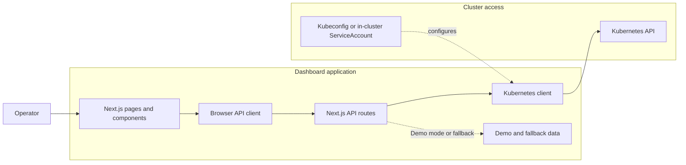

# Kubernetes Dashboard

A web dashboard for inspecting Kubernetes cluster resources and operating workloads. It is built with Next.js and can show demo data or query a cluster through the Kubernetes client.

> **Status: experimental.** The interface and API routes are under active development. Demo data, placeholder metrics, and client-side demo authentication are present. Do not expose this application to an untrusted network or use it to manage production clusters.

## What It Includes

- Cluster overview, nodes, namespaces, pods, services, and workload pages.
- Views for Deployments, StatefulSets, DaemonSets, Jobs, and CronJobs.
- Storage, autoscaling, configuration, security, Helm, Gateway API, and CRD views.
- Pod logs and exec tools, YAML viewing, resource actions, and a terminal interface.
- An AI workloads page for GPU and AI-serving workload inventory.
- Demo mode with generated sample cluster data.

Some screens or metrics use demo/fallback data and may not reflect live cluster state. The AI workloads page is an inventory view; this repository does not currently include an LLM/provider integration or AI-generated troubleshooting assistant.

## Architecture

- `src/app/` contains the Next.js App Router pages and API route handlers.
- `src/components/` contains shared dashboard and resource UI.
- `src/lib/api-client.ts` connects the browser UI to the app's API routes.
- `src/lib/k8s-client.ts` loads Kubernetes configuration for server-side API handlers; `src/lib/k8s-store.ts` and `src/lib/demo-data.ts` provide fallback and demo data.

In demo mode, API routes return sample data. Outside demo mode, routes use the available Kubernetes configuration where implemented; some pages and metrics still use placeholder or fallback values.



## Requirements

- Node.js 20.9 or later and npm.
- Docker and Docker Compose for the container workflow.
- `kubectl` and access to a Kubernetes cluster only if using the Kubernetes manifests.

## Run Locally

```bash
npm ci
npm run dev
```

Open [http://localhost:3000](http://localhost:3000). In demo mode, the app uses sample data and automatically signs in with its demo identity. The sign-in page also displays the demo credentials: `admin@k8s.local` / `admin123`.

To enable demo mode during local development, add this to `.env.local` before starting the dev server:

```dotenv
NEXT_PUBLIC_DEMO_MODE=true
```

Without demo mode, the app attempts to use the available kubeconfig; the sign-in screen still uses demo-only client-side credentials.

For a production build:

```bash
npm run build
npm run start
```

Other checks:

```bash
npm run lint
npm run type-check
```

## Docker Demo

The Compose configuration builds and starts the dashboard in demo mode on port 3000:

```bash
docker compose up --build
```

Open [http://localhost:3000](http://localhost:3000). Stop it with `docker compose down`. This configuration does not connect the container to your Kubernetes cluster.

## Connect to a Cluster

When demo mode is disabled, the server-side Kubernetes client loads its configuration using the standard Kubernetes client configuration lookup. For local development, make sure the account running Next.js can access the intended kubeconfig and context, then start the app without `NEXT_PUBLIC_DEMO_MODE=true`.

The Compose file sets demo mode to `true` and leaves its kubeconfig mount commented out. Changing only the mount is not sufficient to enable live cluster data; configure the container's credentials and disable demo mode deliberately. Do not mount a broadly privileged personal kubeconfig into a publicly reachable container.

### Kubernetes Manifests: Review Before Use

The files under `k8s/` are examples, not production-ready deployment instructions. Before applying them, review and change the permissions and credentials:

- The ClusterRole grants cluster-wide create, update, patch, and delete permissions, including access to Secrets.
- The ConfigMap manifest includes a Secret with sample credentials; base64 encoding is not encryption.
- The application sign-in is implemented in client-side code with hard-coded demo credentials. It is not a security boundary, and the Kubernetes API routes must not be treated as protected by that sign-in.
- The manifests use the `kubernetes-dashboard:latest` image. Build and make an appropriately tagged image available to your cluster before deploying.

Only after reviewing and replacing these settings should you consider `npm run k8s:deploy`. The script applies every manifest in `k8s/` to the currently selected cluster and namespace. Use a least-privilege ServiceAccount and real authentication before connecting this dashboard to sensitive workloads.

## Configuration and Scripts

| Command | Purpose |
| --- | --- |
| `npm run dev` | Start the Next.js development server |
| `npm run build` | Build the production app |
| `npm run start` | Start the production app |
| `npm run lint` | Run ESLint |
| `npm run type-check` | Run the TypeScript compiler without emitting files |
| `npm run docker:build` | Build the `kubernetes-dashboard` image |
| `npm run docker:run` | Run the image on port 3000 |
| `npm run docker:compose` | Start the Compose service in the background |
| `npm run docker:stop` | Stop the Compose service |
| `npm run k8s:deploy` | Apply manifests from `k8s/` to the current cluster |
| `npm run k8s:delete` | Delete manifests from `k8s/` in the current cluster |
| `npm run k8s:status` | Show matching pods and services |

Demo mode is controlled in client and server code by `NEXT_PUBLIC_DEMO_MODE`. The Compose configuration sets it to `true`. Keep credentials and cluster access out of committed files; the current manifests are examples and must be hardened before use.

## Contributing

Bug reports and focused improvements are welcome. Please include reproduction steps for bugs and avoid committing credentials, kubeconfig files, or real cluster data.
